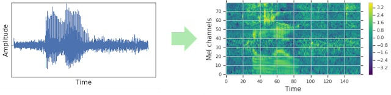
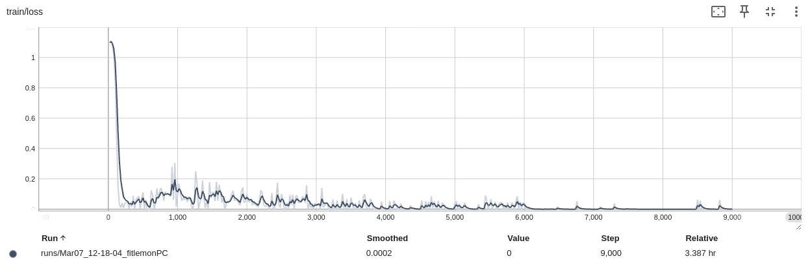
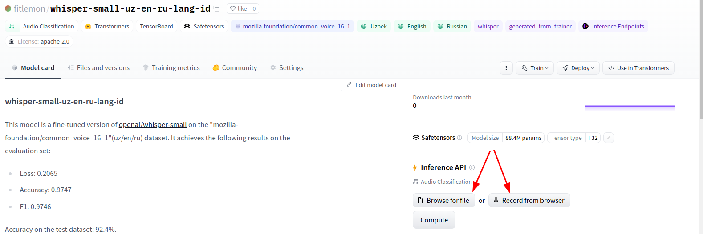

<h1 align="center">Whisper-Small-Fine-Tuning for Language-Identification-(UZ/RU/EN)</h1>

<p align="center">
  <a href="https://github.ink/fitlemon/whisper-small-uz-en-ru-lang-id/stargazers">
    
  </a>
</p>


 <span style='font-size: 17px;'>**Author**:</span> 
Davron Ikhmatullaev

Contacts: 
<br>
[](mailto:ihmatullaev@gmail.com)
<br>
[](mailto:ikhmatullaev.dm@phystech.edu)<br>
[](https://www.t.me/ihmatullaev/)<br>
[](https://www.linkedin.com/in/davron-ikhmatullaev/)


<h2 align="left", id="About">About 💬</h2>

This repository contains the notebook to fine-tune and evaluate [Whisper models](https://huggingface.co/openai/whisper-small) to Audio-Classification task.
Fine-tuned model was uploaded to the [huggingface hub](https://huggingface.co/fitlemon/whisper-small-uz-en-ru-lang-id)🤗.

- ⚡️ Model showed 97.47% while the training and 92.4% accuracy on the evaluation.
- 🎯 All the steps for preprocessing data and fine-tuning the pretrained model described in the [notebook](./lang_detect.ipynb).

[](https://huggingface.co/fitlemon/whisper-small-uz-en-ru-lang-id)

<h2 align="left", id="summary">Fine-tuning summary step by step 🔍</h2>

<h3>Objective</h3>
 Training a model that can classify audio clips into one of three languages: Uzbek, Russian, or English.
        
- <i>Input</i>: Audio Clip 
- <i>Output</i>: Probabilities for the three classes (uz, ru, en)

<h3>Pre-Trained Model Choice: Whisper</h3>
 
---

I chose OpenAI's [Whisper model](https://huggingface.co/openai/whisper-small) for its exceptional capabilities:

1. State-of-the-Art Performance: Whisper excels in speech recognition and language understanding, crucial for this language classification task.

2. Multilingual Support: It's proficient across multiple languages, including my targets: Uzbek, Russian, and English.

3. Adaptability: Whisper can handle various audio qualities and environments, making it versatile for my needs.

4. Pre-trained on Diverse Data: Its training on a wide array of languages and conditions enhances its accuracy and generalization.
5. Open Source and Community Support: By choosing an open-source model like Whisper, I could leverage the collective knowledge and contributions of the community


<h3>Choice of Dataset</h3>

---

For this project, I selected the [Mozilla Common Voice dataset](https://huggingface.co/datasets/mozilla-foundation/common_voice_16_1), motivated by the following:

1. Language Diversity: With recordings in 120 languages, including substantial data for target languages (Uzbek, Russian, and English), this dataset is ideal for language classification task.

2. Volume and Quality: The dataset offers over 19,673 validated hours from more than 30,328 total recorded hours, providing a rich, high-quality pool of data for effective model training.


It should be mentioned, that because commonvoice dataset has a huge size (100Gb fo only English part) and for some reason there is no availability to download only part of data, the streaming mode was chosen to work with data.
```python
...
common_voice_train_uz = load_dataset("mozilla-foundation/common_voice_16_1", "uz", split='train', trust_remote_code=True, token=env('HUGGING_TOKEN'), streaming=True)
...
```

<h3>Data Preprocessing Overview</h3>

---

Effective preprocessing is essential for optimizing audio data for the Whisper model. Prepocessing involves:

1. Sampling Rate Adjustment: We ensure all audio clips are sampled at 16kHz to match the Whisper model's requirements, crucial for preserving the original signal's quality.

2. Uniform Length Processing: Audio samples are standardized to 30 seconds. Shorter clips are zero-padded, and longer ones are truncated to maintain consistency without the need for an attention mask.

3. Log-Mel Spectrogram Transformation: The processed audio is then converted into log-Mel spectrograms, visual representations of the signal's frequency content expected by the Whisper model.



<h3>Training</h3>

---

I utilized the Trainer class from Hugging Face's Transformers library for our model's training process. This choice provided with a feature-complete training API optimized for PyTorch, supporting a wide range of customizable training options through the TrainingArguments class.

```python
from transformers import TrainingArguments, Trainer


training_args = TrainingArguments(
    output_dir="whisper-small-uz-en-ru-lang-id",
    evaluation_strategy="steps",
    save_strategy="steps",
    max_steps=9000,
    eval_steps=3000,
    save_steps=3000,
    num_train_epochs=3,
    logging_steps=20,
    learning_rate=3e-5,
    gradient_accumulation_steps=4,
    per_device_train_batch_size=2,
    per_device_eval_batch_size=2,
    warmup_ratio=0.1,
    load_best_model_at_end=True,
    metric_for_best_model="accuracy",
    hub_token=env('HUGGING_WRITE'),
    push_to_hub=True,
    fp16=True,

)


trainer = Trainer(
  model,
  training_args,
  compute_metrics=compute_metrics,
  train_dataset=common_voice['train'],
  eval_dataset=common_voice['eval'],
  data_collator=data_collator,
  tokenizer=feature_extractor,
)
```

<h4>Training Results</h4>

---

Training process yielded impressive results, demonstrating the model's ability to accurately classify audio clips into the targeted languages. The following table summarizes our key metrics across three epochs:

| Training Loss | Epoch | Step | Validation Loss | Accuracy | F1     |
|:-------------:|:-----:|:----:|:---------------:|:--------:|:------:|
| 0.0252        | 1  | 3000 | 0.3089          | 0.953    | 0.9525 |
| 0.0357        | 2  | 6000 | 0.1732          | 0.964    | 0.9637 |
| 0.0           | 3  | 9000 | 0.2065          | 0.9747   | 0.9746 |

As seen from the table, the model improved significantly in terms of accuracy and F1 score over the epochs, while maintaining a competitive validation loss. These metrics underscore the effectiveness of our fine-tuning approach and the suitability of the Whisper model for audio classification tasks.

<h4>Loss curve</h4>



Interpretation of the plot:

- <b>Rapid Decrease</b>: Loss started from the high point. This is common as the model starts learning from a randomly initialized state or from pre-trained weights that are not yet fine-tuned for the specific task. But after few steps the loss rapidly decreases. This indicates that the model is learning and adjusting its weights effectively to minimize the loss on the training data.

- <b>Smoothing Out</b>: As training continues, the loss starts to smooth out and decrease at a slower rate. This shows that the model is starting to converge and find an optimal set of weights for this particular task.

- <b>Final Loss</b>: By the end of training (after step 6,000), the loss is quite low and appears to have stabilized. This suggests that further training may not result in significant improvements and that the model has reached its capacity for learning from this dataset with the given architecture and hyperparameters.

The smoothed line, which represents an average of the loss values to give a clearer view of the overall trend, shows very little variance towards the end, which is an indication of a stable training process.

<h3>Evaluation and Improvement Strategies</h3>

---

Model achieved an accuracy of 92.4% 🏅 on the test set, indicating a little bit overfitting, nevertheless it is a promising result for the audio classification task. At the end of the day, as with any machine learning model, there is always room for improvement.

Strategies for Improving Accuracy
To potentially increase the model's accuracy, I am considering the following strategies:

1. Data Augmentation: Increasing the size of the training dataset can provide more examples for the model to learn from, which could lead to better generalization. Implementing smart batching strategies can also enhance the learning process.

2. Hyperparameter Optimization: Adjusting the training hyperparameters, including exploring different optimizers, can significantly impact model performance. Systematic hyperparameter tuning is essential to find the most effective configurations.

3. Model Variations: Exploring different pretrained models as starting points can help identify a model architecture that is more suited to the specifics of our classification task.

4. In-depth Model Tuning: Fine-tuning not just the top layers but also the deeper neuron layers of the neural network could lead to better feature extraction and, consequently, higher accuracy.

References: 
- [Optimizing Transformers Models for Peak Performance](https://medium.com/aimonks/optimizing-transformers-models-for-peak-performance-cd6d740d3bf3)
- [Large Transformer Model Inference Optimization](https://lilianweng.github.io/posts/2023-01-10-inference-optimization/)

Code for training:

```python
from tqdm.auto import tqdm

num_testing_steps = 1500

progress_bar = tqdm(range(num_testing_steps))

metric = evaluate.load("accuracy")
model.eval()
for batch in eval_dataloader:
    with torch.no_grad():
        outputs = model(**batch)

    logits = outputs.logits
    predictions = torch.argmax(logits, dim=-1)
    metric.add_batch(predictions=predictions, references=batch["labels"])
    progress_bar.update(1)

metric.compute()
```

<h3>Model inference</h3>

---

On the huggingface model card there is a opportunity to check the model by Inference API:

[](https://huggingface.co/fitlemon/whisper-small-uz-en-ru-lang-id)

